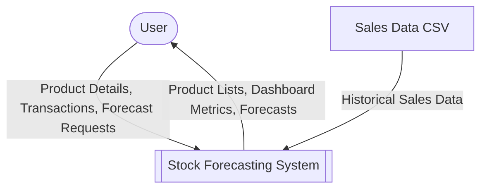
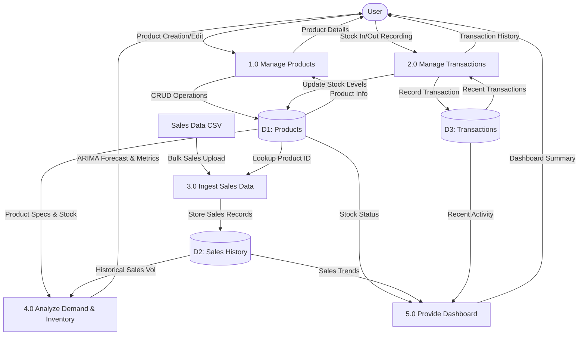

# System Architecture Diagrams

This document provides the Context Diagram and Data Flow Diagram (DFD) Level 0 for the Stock Forecasting System.

## Context Diagram

The Context Diagram shows the system as a single process and its interactions with external entities.

---

## Data Flow Diagram (DFD) Level 0

The DFD Level 0 breaks down the system into its major functional processes and data stores.

### Process Descriptions

1.  **1.0 Manage Products**: Handles the registration and maintenance of product information including cost, lead time, and categories.
2.  **2.0 Manage Transactions**: Records manual stock movements (incoming/outgoing) and updates current inventory levels.
3.  **3.0 Ingest Sales Data**: Processes bulk sales history from CSV files to populate the forecasting engine.
4.  **4.0 Analyze Demand & Inventory**: Uses ARIMA models to predict future demand and calculates Economic Order Quantity (EOQ), Safety Stock, and Reorder Points.
5.  **5.0 Provide Dashboard**: Aggregates data from across the system to provide high-level insights into inventory health and recent activity.

### Data Stores

*   **D1: Products**: Stores static product attributes and current inventory counts.
*   **D2: Sales History**: Contains time-series data of past sales used for forecasting.
*   **D3: Transactions**: Audit log of all stock movements performed in the system.
