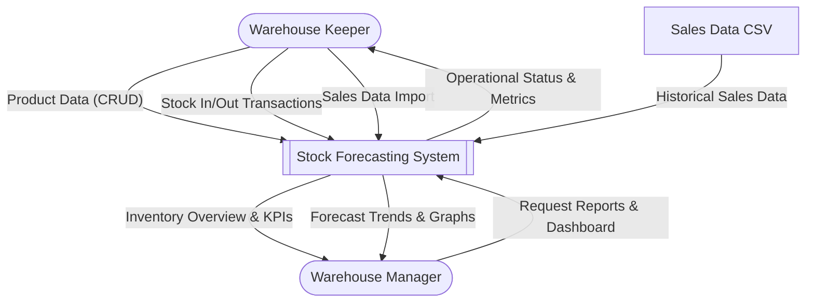
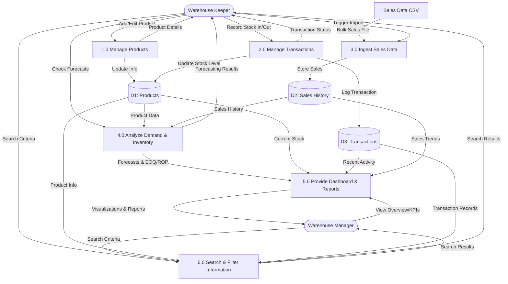

# System Architecture & Scope

This document outlines the system scope, user roles, and architectural diagrams for the Stock Forecasting System.

## 1. System Scope & User Roles

The system is designed to support two primary user roles with distinct responsibilities:

### 1.3.1 Warehouse Keeper (ผู้ดูแลคลังสินค้า)
Responsible for day-to-day operations and data entry.
*   **Product Management**: Add, edit, search, and delete product information.
*   **Transaction Management**: Record stock-in and stock-out transactions.
*   **Data Import**: Import historical sales data via CSV or Excel files.
*   **Forecast Verification**: Check demand forecast results.
*   **Metric Review**: View calculated inventory metrics (Economic Order Quantity (EOQ), Safety Stock, Reorder Point (ROP)).
*   **Stock Monitoring**: Check product movement history and current stock levels via summary views.

### 1.3.2 Warehouse Manager (ผู้จัดการคลังสินค้า)
Responsible for high-level monitoring, analysis, and decision making.
*   **Inventory Overview**: Monitor total stock inventory and individual product status.
*   **Demand Analysis**: View future demand trends based on forecasting models.
*   **Replenishment Status**: specific check on replenishment needs (Current vs. Safety Stock vs. ROP).
*   **Performance Tracking**: Monitor inventory management efficiency via KPI summaries.
*   **Reporting**: View reports and graphical visualizations of system data.

---

## 2. Context Diagram

The Context Diagram illustrates the interaction between the two user roles, the system, and external data sources.

---

## 3. Data Flow Diagram (DFD) Level 0

The DFD Level 0 details the internal processes and how they relate to the specific user roles.

### Process Descriptions

1.  **1.0 Manage Products**: Allows the **Warehouse Keeper** to maintain product master data (cost, lead time, attributes).
2.  **2.0 Manage Transactions**: Enables the **Warehouse Keeper** to record physical stock movements, updating inventory levels in real-time.
3.  **3.0 Ingest Sales Data**: Processes bulk sales history uploads initiated by the **Warehouse Keeper** to feed the forecasting engine.
4.  **4.0 Analyze Demand & Inventory**: System process that runs ARIMA forecasting and calculates EOQ, Safety Stock, and ROP. Results are used by the Keeper for verification and aggregated for the Manager.
5.  **5.0 Provide Dashboard & Reports**: Aggregates all system data to provide the **Warehouse Manager** with high-level insights, graphs, and performance indicators.
6.  **6.0 Search & Filter Information**: Allows both the **Warehouse Keeper** and **Warehouse Manager** to query product details and transaction history using specific criteria (e.g., product code, date range).
